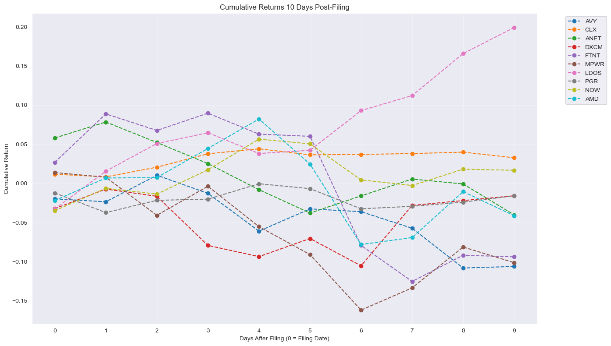
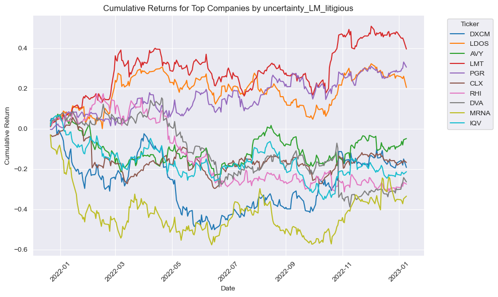
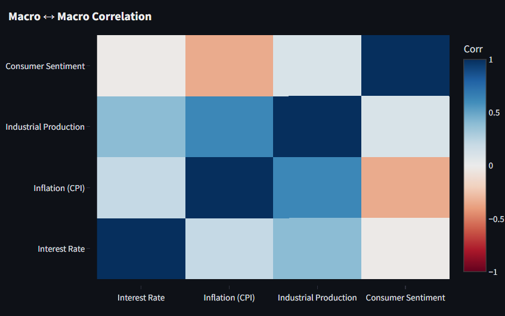
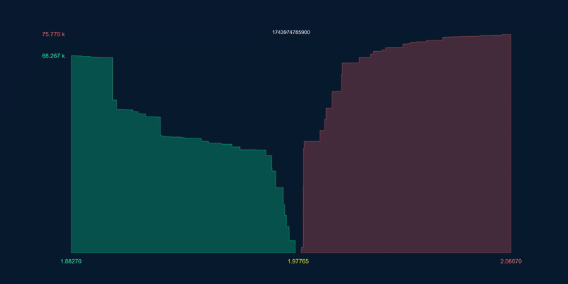

## About Me

What's up? hey\|you

I am an awesome student at Lehigh, you should hire me!

<!-- Upload your own photo and change the path -->

  <!-- Replace with your head‑shot when ready -->
  

## Portfolio

<!-- You can link to other websites, PDFs in this repo, and other pages in this repo -->

### 1. SEC‑Filing Sentiment & Price‑Impact Study
***[Assessing the Stock‑Price Impact of Legal and Operational Uncertainty](midterm/report.md)***

---

---

***[Team Project: The Reddest Bulls — Forex Factor Regression Model](https://thereddestbulls.streamlit.app/)***

---

_**Personal Project: Orderbook Visualizer for Cryptocurrency built from Live Websocket data**_

---

## Career Objectives

* **Equity Research – Fundamental & QUantitative Insight:** Turn raw data and company filings into clear stock calls, mixing DCF/comp‑sheet rigor with machine‑learning screens and alt‑data checks.
Write what you want. 
* **Equity & Debt Capital Markets:** Structure and execute IPOs, follow‑on equity offerings, and investment‑grade/high‑yield debt issuances that align with clients’ capital‑raising goals.
* **Leveraged Finance & Sponsor Coverage:** Evaluate leveraged‑buyout structures, covenant packages, and credit profiles to support private‑equity sponsors and corporate borrowers.

## Hobbies

Rowing, Piano, Trading 

---
