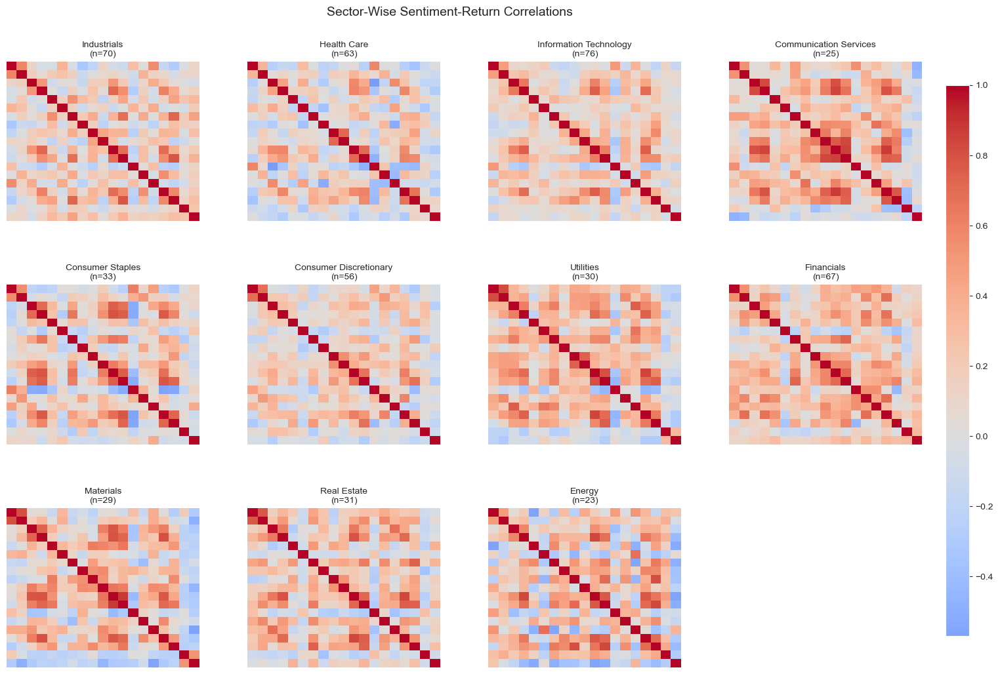

## About Me

What's up? hey\|you

I am an awesome student at Lehigh, you should hire me!

<!-- Upload your own photo and change the path -->

  <!-- Replace with your head‑shot when ready -->
  

## Portfolio

<!-- You can link to other websites, PDFs in this repo, and other pages in this repo -->

### 1. SEC‑Filing Sentiment & Price‑Impact Study
***[Assessing the Stock‑Price Impact of Legal and Operational Uncertainty](report.ipynb)***

---

---

***[Team Project: The Reddest Bulls — Forex Factor Regression Model](https://thereddestbulls.streamlit.app/)***

---

_**Personal Project: Orderbook Visualizer for Cryptocurrency**_

---

## Career Objectives

Write what you want. 

Sell yourself!

---

## Hobbies

Maybe include a little about these, especially if they are the kinds of things that work well in interviews.

---

Page template forked from <a href="https://github.com/evanca/quick-portfolio">evanca</a>

<!-- Remove above link if you don't want to attibute -->
